# 架构说明

## 定位

本项目将 ExecGo 作为执行内核，把 LangGraph 家族框架用于编排层（Orchestrator Layer），通过统一契约实现跨语言等价行为。

## 分层模型

1. Request Layer: 接收训练请求 `TrainingRequest`
2. Graph Layer: 构建和执行编排图
3. Adapter Layer: 适配 ExecGo HTTP/gRPC API
4. Report Layer: 汇总任务状态并生成 `TrainingResult`

## 核心节点

- `buildPlan`: 将请求映射为 ExecGo `TaskGraph`
- `validatePlan`: 执行依赖与参数约束校验
- `submitToExecgo`: 发送任务图到 ExecGo
- `pollUntilDone`: 轮询并更新状态
- `analyzeFailure`: 失败分类与建议动作
- `finalizeReport`: 产出可复现报告

## 启动前预检查节点

在执行任一 Orchestrator 前，先运行 `scripts/check-execgo-version.ps1` 做上游版本预检查：

- 若发现上游已更新，应优先评估新特性接入点
- 该策略可降低编排层与执行内核长期偏移的风险
- 版本基线记录在 `shared/execgo.version.lock.json`

## 统一状态键

- `request`
- `taskGraph`
- `submission`
- `taskStates`
- `diagnostics`
- `finalReport`

## 数据流

```mermaid
flowchart LR
userInput[UserInput] --> graphLayer[LangGraphOrchestrator]
graphLayer --> buildPlanNode[buildPlan]
buildPlanNode --> validatePlanNode[validatePlan]
validatePlanNode --> submitNode[submitToExecgo]
submitNode --> execgoApi[ExecGoAPI]
execgoApi --> pollNode[pollUntilDone]
pollNode --> analysisNode[analyzeFailure]
analysisNode --> reportNode[finalizeReport]
reportNode --> outputResult[TrainingResult]
```

## 跨语言一致性策略

- 共享 `shared/spec/taskgraph.schema.json`
- 共享场景输入 `scenarios/*/request.json`
- 共享预期输出 `scenarios/*/expected.result.json`
- 各语言只实现适配层差异，不改动语义层
